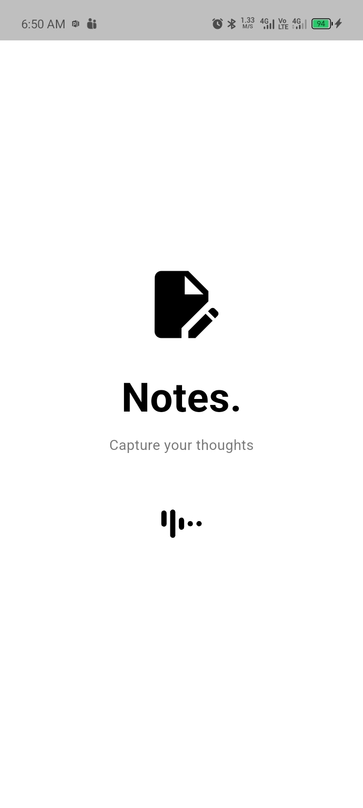
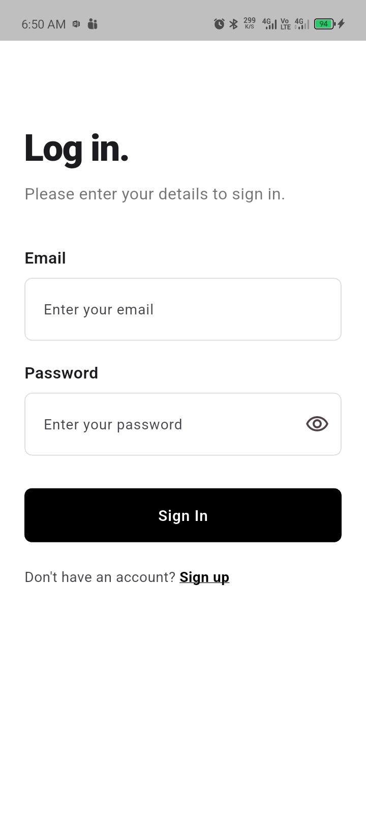
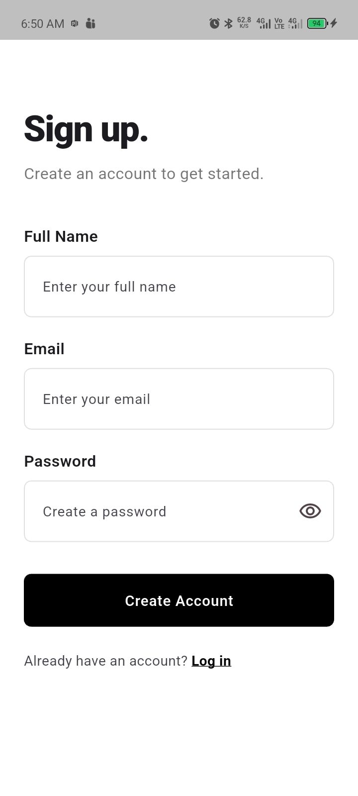
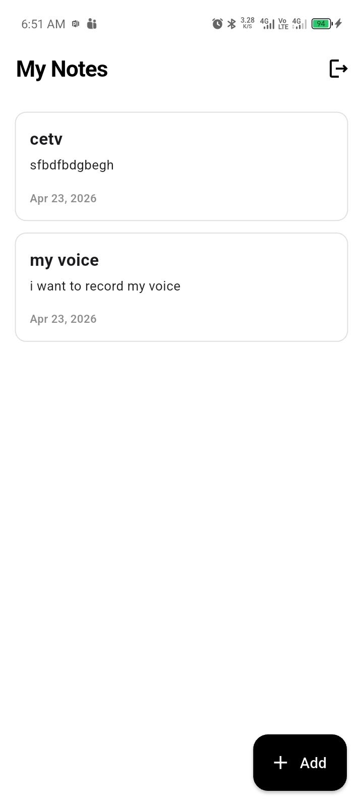
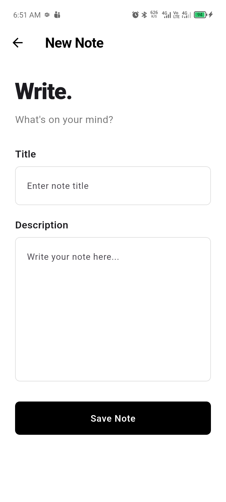
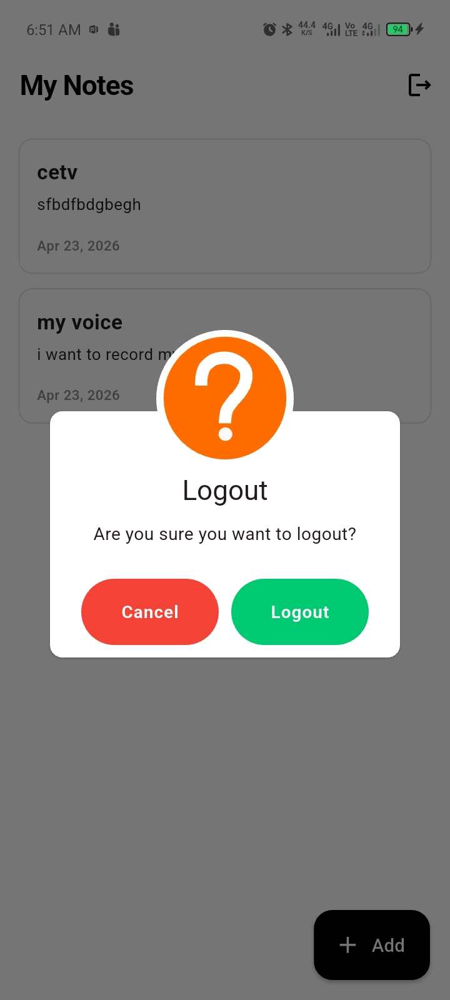

# Notes App Assessment

A clean, professional, assessment-ready Flutter application that lets users capture, view, and manage their thoughts securely. The application adopts Clean Architecture principles, leveraging Firebase for its backend and using GetX alongside Go Router to ensure high performance, maintainability, and clean navigation.

## 🚀 Features

- **Splash Screen**: Checks user session securely before navigating to either Authorization or the Home Dashboard. Displays only on the initial session startup and first launches.
- **Authentication system**: Secure login and email/password registration backed by Firebase Auth.
- **Real-Time Notes Management**:
  - Add newly structured text notes.
  - Review notes populated smoothly via Cloud Firestore (Ordered from newest to oldest).
- **Logout flow**: Secure logout functionality to kill user sessions seamlessly.
- **Minimalist & Professional UI/UX**: Uses a unified black & white "minimalist ink" design theme tailored for clarity. Contains clean spacing, dynamic loading states, intuitive toasters, and highly legible fonts.

## 🏗 Architecture

This project strictly adheres to **Clean Architecture** patterns alongside robust **OOP paradigms**.

1. **Separation of Concerns**: Logically decoupled into Features (`auth`, `notes`, `splash`), scaling each with its own `data`, `domain`, and `presentation` layers.
2. **Generics & Flexibility**: Base services (such as `AuthService`, `FirestoreService`) handle operations modularly for seamless scaling.
3. **Dependency Injection**: Dependencies and logical orchestrations are loaded intelligently using `GetX` bindings (`LazyPut`).
4. **State Management**: Using object-oriented `GetX` Controllers keeping pure isolated UI (View). No business logic is nested inside `build()` methodologies.
5. **Navigation**: Configured robustly with `go_router` dictating flow security explicitly across app bounds.

### Folder Structure (Preview)
```text
lib/
 ┣ app/         # Global App Configurations (Routing, Themes)
 ┣ core/        # Core Layer (Services, Singletons, App Constants, UI Utilities)
 ┣ features/    # Bounded Features (Auth, Notes, Splash Layers)
 ┗ main.dart    # Application Entry
```

## 📦 Packages Used

- **`firebase_core`, `firebase_auth`, `cloud_firestore`**: For authentication and secure, real-time database management.
- **`get`**: For powerful Dependency Injection and State Management.
- **`go_router`**: For advanced, declarative screen routing.
- **`shared_preferences`**: A straightforward local storage system helping determine first-app initializations.
- **`toastification`**: For elegant, professional toasts for loading, feedback, and error reporting.
- **`flutter_screenutil`**: Making the User Interface highly adaptive across infinite device screens.
- **`loading_animation_widget`**: Sophisticated native animations enhancing the minimal look logic.

## 🛠 Setup & Installation

### 1. Prerequisites
- Flutter SDK (`>=3.0.0 <4.0.0`)
- Valid Firebase Project
- Registered Android Application in the respective Firebase project console.

### 2. Firebase Configuration
- Download the generated `google-services.json` from your Firebase project.
- Drop the file into your local project environment precisely under this path: `android/app/google-services.json`
- Ensure Authentication (Email/Password) and Firestore Database are **enabled** in Firebase Console.
- Configure Firestore security guidelines. Basic configuration for assessment:
```text
rules_version = '2';
service cloud.firestore {
  match /databases/{database}/documents {
    match /notes/{note} {
      allow read, write: if request.auth != null && request.auth.uid == resource.data.userId;
    }
  }
}
```

### 3. Running the Project Locally
```bash
# Clone this repository locally. 

# Fetch all related dependencies
flutter pub get

# Generate fresh builds mapped natively
flutter run
```

## 📸 Screenshots

| Splash Screen | Login Screen | Registration Screen |
| :---: | :---: | :---: |
|  |  |  |

| My Notes Dashboard | Add New Note | Logout Dialog |
| :---: | :---: | :---: |
|  |  |  |


---

### 📝 Repository Submission Note
*This repository represents a completed Flutter Assignment Round covering 100% OOP, Clean Architecture schemas, specific UI/UX rulesides, Firebase connections, and scalable structuring to fulfill modern mobile development tasks.*